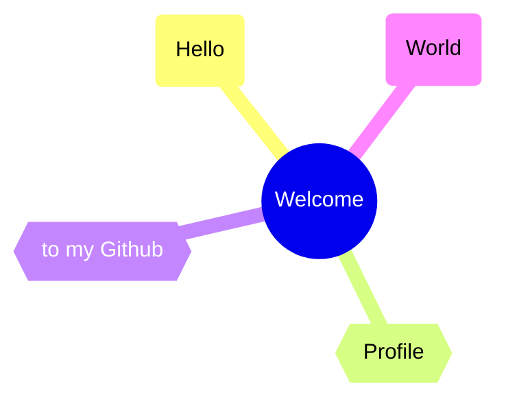
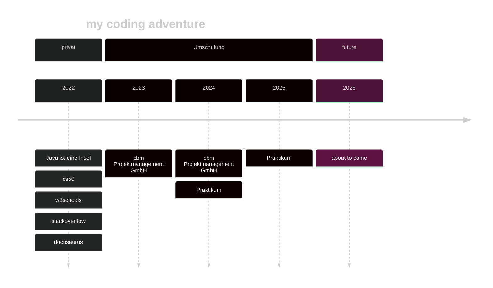

<p align="center">

</p>




## About me


```java
public class About extends Me{
    public String nickname = "P";
    public String city = "Hamburg";
    public String current_work = "Software Developer Apprentice";
    private String[] hobbies = { "Basketball", "Handwerken", "Coding" };

    private void Ambitions() {
        FindInternship();
        CreateSkyNet();
    }
}
```




## projects
- [P76ers.github.io ](https://github.com/P76ers/P76ers.github.io) aka `codingDocs`
  
  Live operation on Github-Pages: [codingDocs](https://p76ers.github.io/)
  > Documentation Website about my Coding-Experience
- Umschulung [@cbm](https://cbm-projektmanagement.de/) (Bildungsträger)
  - Vorlesung repositories 
    - [c++](https://github.com/P76ers/cpp)
    - [sql](https://github.com/P76ers/sql)
    - [php](https://github.com/P76ers/php)
    - [OOP mit c# @console](https://github.com/P76ers/cSharp) 
    - [python](https://github.com/P76ers/python)
    - [c# @console](https://github.com/P76ers/CSharpAdvancedConsole) `Modul für Anwendungsentwickler`
    - [c# @windowsForms](https://github.com/P76ers/cSharpWindowsForms) `Modul für Anwendungsentwickler`
  - Projekte
    - [SpDesign](https://github.com/P76ers/SpDesign)  `Website about a men's outfitter`
    - [serviceOne](https://github.com/P76ers/ServiceOne)  `Windows-Forms Databasemanagementsystem @c#`

## contact me

[](mailto:mail@prwz.maiwandi@gmail.com)

## Skills


<div> 
    <a href="https://devdocs.io/c/"></a>
  <a href="https://devdocs.io/cpp/"></a> 
  <a href="https://learn.microsoft.com/de-de/dotnet/csharp/"></a>   
  <a href="https://www.oracle.com/java/"></a>
  <a href="https://www.python.org/"></a>
  <a href="https://www.autohotkey.com/"></a>
  <br>

  <a href="https://html.spec.whatwg.org/multipage/"></a> 
  <a href="https://www.w3.org/Style/CSS/Overview.en.html"></a>
  <a href="https://developer.mozilla.org/en-US/docs/Web/JavaScript"></a> 
    <a href="https://www.php.net/"></a>
  <a href="https://tailwindcss.com/"></a><br>

  <a href="https://www.mysql.com/de/"></a>
  <a href="https://www.postgresql.org/"></a> 
  <a href="https://insomnia.rest/"></a> <br>

  <a href="https://nodejs.org/en"></a> 
  <a href="https://react.dev/"></a> 
  <a href="https://spring.io/"></a> 
  <a href="https://maven.apache.org/"></a><br>

  <a href="https://docusaurus.io/"></a>
  <a href="https://git-scm.com/"></a> 
  <a href="https://github.com/"></a> <br>

  <a href="https://mermaid.js.org/"></a> 
  <a href="https://app.diagrams.net/"></a>
  <a href="https://xmind.app/"></a>
  <a href="https://miro.com/de/"></a> <br>

  <a href="https://code.visualstudio.com/"></a>
  <a href="https://www.jetbrains.com/de-de/idea/"></a>
  <a href="https://www.jetbrains.com/de-de/pycharm/"></a>
  <a href="https://www.jetbrains.com/de-de/rider/"></a> 
</div>

## my stats


 

<picture>
  <source media="(prefers-color-scheme: dark)" srcset="https://raw.githubusercontent.com/p76ers/p76ers/output/github-contribution-grid-snake-dark.svg">
  <source media="(prefers-color-scheme: light)" srcset="https://raw.githubusercontent.com/p76ers/p76ers/output/github-contribution-grid-snake.svg">
  
</picture>
