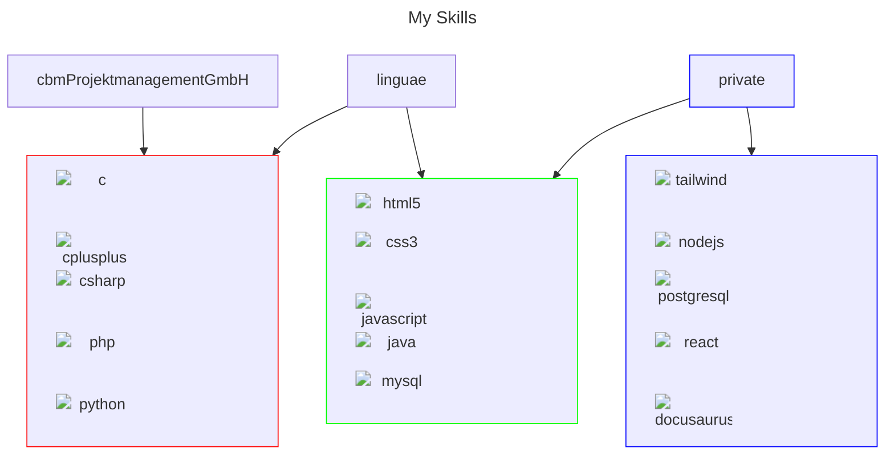
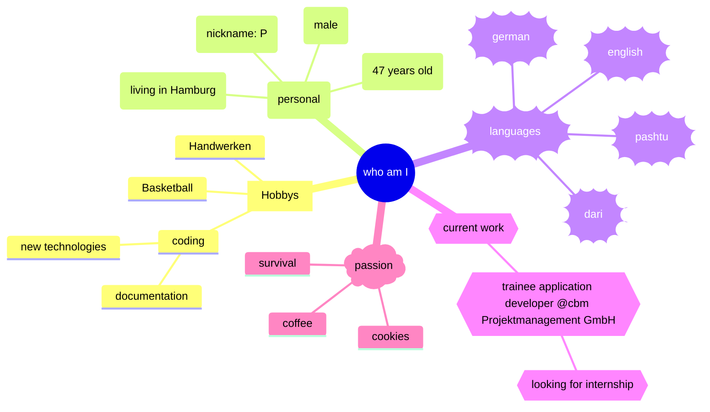
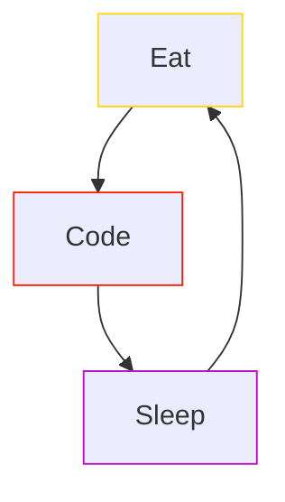

<p align="center">

</p>

```c#
Console.WriteLine("Hello World!");
```

## About me








## contact me

[](mailto:mail@prwz.maiwandi@gmail.com)

## Skills

<div> 
     
   
   
   
   
   
   
   
   
   
   
   
   
   
   
</div>

## support me

<a href="https://www.buymeacoffee.com/p76ers" target="_blank" rel="noreferrer nofollow">

</a>

[](https://www.paypal.me/p76ers)

## my stats


 

<picture>
  <source media="(prefers-color-scheme: dark)" srcset="https://raw.githubusercontent.com/p76ers/p76ers/output/github-contribution-grid-snake-dark.svg">
  <source media="(prefers-color-scheme: light)" srcset="https://raw.githubusercontent.com/p76ers/p76ers/output/github-contribution-grid-snake.svg">
  
</picture>
